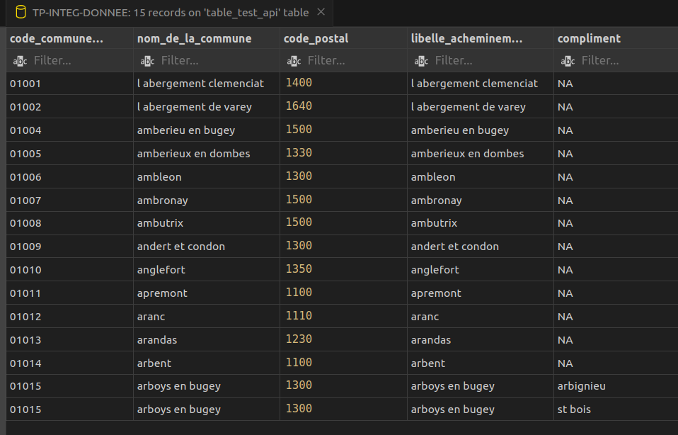
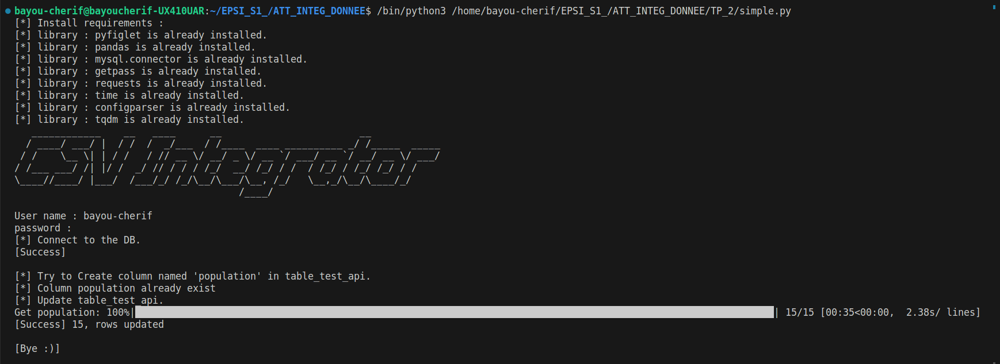
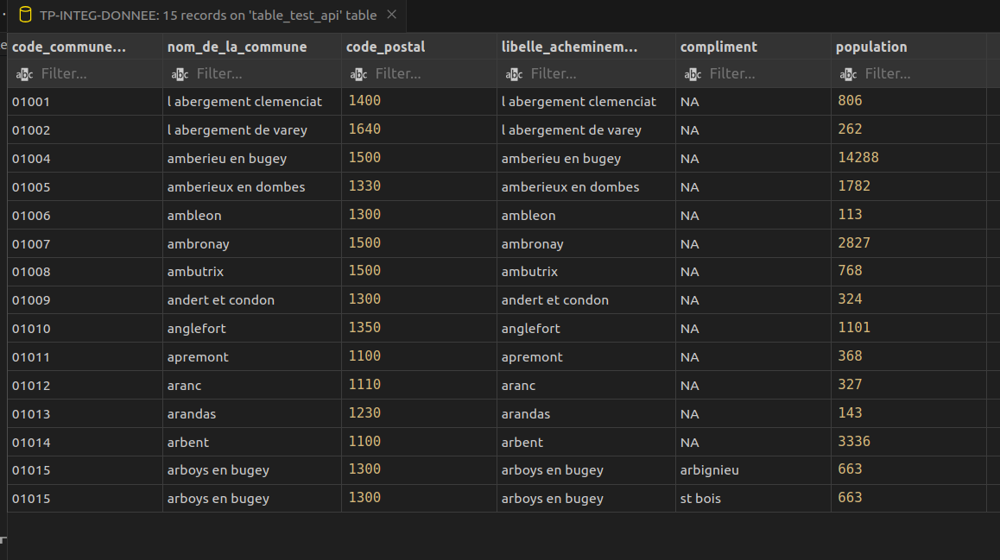

# CSV Integrator
## Utilisation
### lancement du script : 
python3 PATH_TO/ATT_INTEG_DONNEE/TP_2/simple.py
### Nom d'utilisateur et mots de passe: 
Vous serai invité à saisir le nom d'utilisateur et le mots de passe pour vous connecté à votre base de donnée.

## Configuration
### Vous pouvez editer le fichier config.ini
host = le nom de la machine généralement localhost 
database = le nom de la base de donnée à mettre à jour  
port = le port  
table = le nom de la table à mettre à jour  

#### Assuré-vous d'avoir les accées et les priviléges nécessaires pour mettre à jours votre base de donnée. 
#### Assuré-vous que le nom de la base et exact et que le table est bien présente.  
# Exemple : 
## Lancement du script : 

### Traitement

## Résultats : 

